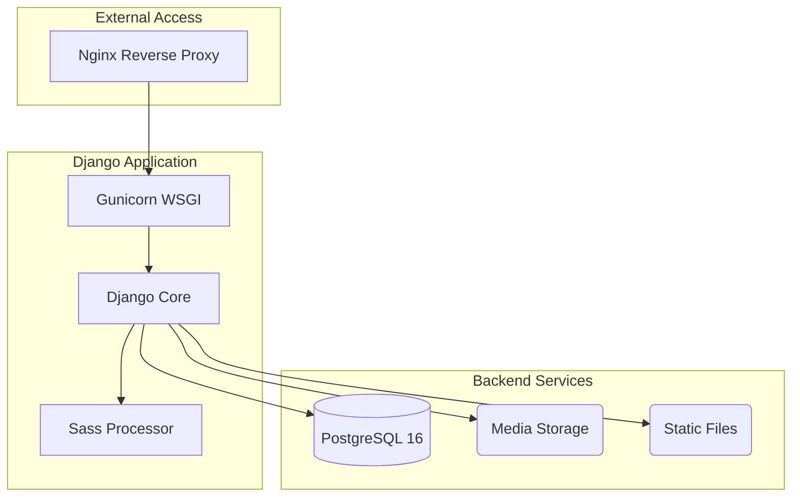

# 🛋️ Furniture Store

<p align="center">
  
  
  
  
</p>


A **E-commerce platform** specialized in furniture, built with **Django 5**. This project is fully containerized with **Docker**, using **Nginx** as a reverse proxy and **PostgreSQL** for data persistence.

---

## 🚀 Quick Start (Production)

Follow these steps to deploy the application on your server.

### 1. Clone the Repository
```bash
git clone https://github.com/Phonkmasti/FurnitureStore.git
cd FurnitureStore
```

### 2. Configure Production Secrets
The project uses a secure mechanism for handling sensitive data through the `sets/` directory.

1.  **Database Password**: Create or edit `./sets/pg_secret_password.txt` and put your database password inside (no spaces):
    ```bash
    echo "your_secure_password" > ./sets/pg_secret_password.txt
    ```

2.  **Environment Variables**: Edit `./sets/set_env.sh` to match your server details:
    ```bash
    nano ./sets/set_env.sh
    ```
    Update the following:
    - `ALLOWED_HOSTS`: Your domain or server IP.
    - `CSRF_TRUSTED_ORIGINS`: `http://your_ip` or `https://your_domain`.

3.  **Apply Variables**: Source the script to export variables to your current shell:
    ```bash
    source ./sets/set_env.sh
    ```

### 3. Nginx Configuration
Edit `./conf.d/nginx.conf` and replace the placeholders with your server's IP or DNS name:
```nginx
server {
    listen 80;
    server_name your_public_ipv4_adress your_public_DNS_adress; # <--- CHANGE THIS
    ...
}
```

### 4. Launch with Docker
Run the following command to build and start all services in detached mode:
```bash
docker compose up -d --build
```

---

## 🛠️ Post-Deployment

### Create Admin User
To access the Django admin panel (`/admin/`), create a superuser inside the running container:
```bash
docker compose exec web python manage.py createsuperuser
```

### Load Demo Data
The system automatically loads category and product fixtures during the first start via `entrypoint.sh`. If you need to reload them:
```bash
docker compose exec web python manage.py loaddata fixtures/goods/goods_Category.json
docker compose exec web python manage.py loaddata fixtures/goods/goods_Products.json
```

---

## 🏗️ Project Architecture



---

## 📂 Deployment Components

- **`backend/`**: Django source code and Dockerfile.
- **`conf.d/`**: Nginx configuration files.
- **`sets/`**: Scripts and files for managing production environment variables and secrets.
- **`compose.yml`**: Main orchestration file.

---


## 🤝 Connect

<p align="center">
  <a href="https://t.me/kapusta123b">
    
  </a>
  <a href="mailto:fartuchoknik22@gmail.com">
    
  </a>
</p>

---

<p align="center">
  
</p>
