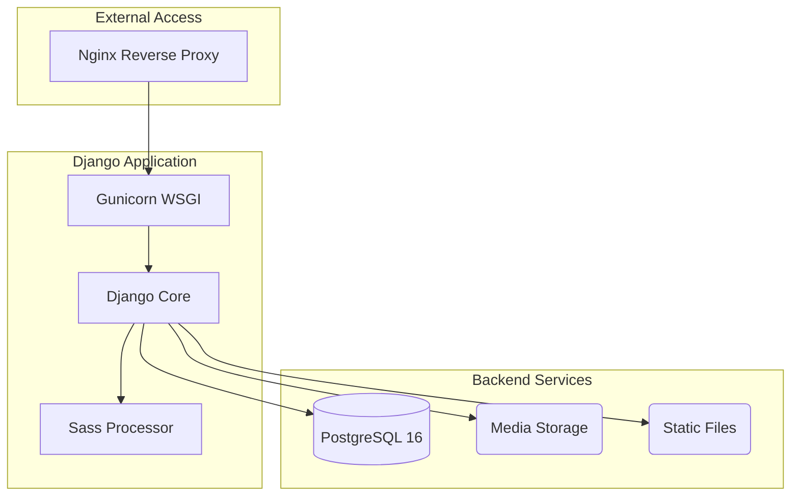

# Furniture Store

<p align="center">
  
  
</p>

А multi-page furniture store. This project is fully containerized with **Docker**, using **Nginx** and **PostgreSQL**.

---

## 🏗️ Project Architecture


```mermaid
graph TD
    subgraph Client[External Access]
        N[Nginx Reverse Proxy]
    end

    subgraph App[Django Application]
        G[Gunicorn WSGI]
        D[Django Core]
        S[Sass Processor]
    end

    subgraph Services[Backend Services]
        DB[(PostgreSQL 16)]
        M(Media Storage)
        ST(Static Files)
    end

    N --> G
    G --> D
    D --> S
    D --> DB
    D --> M
    D --> ST
```

---

## 🚀 Deployment Guide (Linux)

Follow these steps for a clean installation. If you've previously run `docker compose` and it failed, follow the [Troubleshooting](#-troubleshooting) section first.

### 1. Project Preparation
```bash
git clone https://github.com/Phonkmasti/FurnitureStore.git
cd FurnitureStore
```

### 2. Configuration & Secrets

#### 2.1 Database Password
The project uses Docker Secrets. Create your password file:
```bash
# Set your secure password (no spaces)
echo "your_secure_password" > ./sets/pg_secret_password.txt
```

#### 2.2 Environment Variables
You MUST update the environment script with your server details:
```bash
nano ./sets/set_env.sh
```
**Required Changes:**
- `SECRET_KEY`: Set a unique random string.
- `ALLOWED_HOSTS`: Your server IP or domain (e.g., `13.51.10.20`).
- `CSRF_TRUSTED_ORIGINS`: Your site URL (e.g., `http://13.51.10.20`).

**Apply variables to your shell:**
```bash
source ./sets/set_env.sh
```

#### 2.3 Nginx Configuration
Edit `conf.d/nginx.conf` and update `server_name` (line 7):
```nginx
server_name 13.51.10.20; # <--- Replace with your AWS Public IP
```

### 3. Launching the System

Build and start the containers. **Note: you must have sourced the script in step 2.2 in this same terminal session.**
```bash
docker compose up -d --build
```
*If you need `sudo` to run docker, use:*
```bash
sudo -E docker compose up -d --build
```

---

## 🛠️ Post-Deployment & Maintenance

### Initialize Demo Data
The system runs migrations automatically. If data is missing, run:
```bash
docker compose exec web python manage.py loaddata fixtures/goods/goods_Category.json
docker compose exec web python manage.py loaddata fixtures/goods/goods_Products.json
docker compose exec web python manage.py loaddata fixtures/goods/goods_ProductImage.json
```

### Create Administrative Account
```bash
docker compose exec web python manage.py createsuperuser
```
