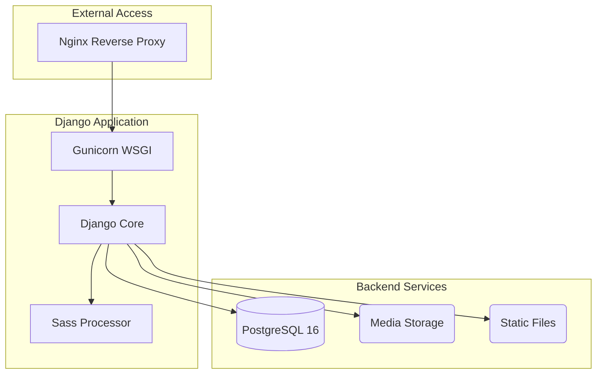

# Furniture Store

<p align="center">
  
  
</p>

А multi-page furniture store. This project is fully containerized with **Docker**, using **Nginx** and **PostgreSQL**.

---

## 🏗️ Project Architecture


```mermaid
graph TD
    subgraph Client[External Access]
        N[Nginx Reverse Proxy]
    end

    subgraph App[Django Application]
        G[Gunicorn WSGI]
        D[Django Core]
        S[Sass Processor]
    end

    subgraph Services[Backend Services]
        DB[(PostgreSQL 16)]
        M(Media Storage)
        ST(Static Files)
    end

    N --> G
    G --> D
    D --> S
    D --> DB
    D --> M
    D --> ST
```

---

## 🚀 Deployment Guide

Follow these steps to deploy the application on any server (Ubuntu/Debian recommended).

### 1. Server Preparation
If Docker is not installed: https://docs.docker.com/desktop/setup/install/linux/

### 2. Project Installation
```bash
git clone https://github.com/Phonkmasti/FurnitureStore.git
cd FurnitureStore
```

### 3. Configuration & Secrets

#### 3.1 Database Password
The project uses Docker Secrets for security. Create your password file:
```bash
# Create the password file (no spaces, just the password)
echo "your_secure_db_password" > ./sets/pg_secret_password.txt
```

#### 3.2 Environment Variables
Edit the environment script to match your production details:
```bash
nano ./sets/set_env.sh
```
**Update these values:**
- `SECRET_KEY`: Set a unique, long random string.
- `ALLOWED_HOSTS`: Your server IP or domain (e.g., `12.34.56.78 example.com`).
- `CSRF_TRUSTED_ORIGINS`: Your site URL (e.g., `http://12.34.56.78`).

**Apply the configuration:**
```bash
source ./sets/set_env.sh
```

#### 3.3 Nginx Setup
Configure Nginx to recognize your server address:
```bash
nano ./conf.d/nginx.conf
```
Update line 7:
```nginx
server_name 12.34.56.78 example.com; # <--- Replace with your IP or Domain
```

### 4. Launching the System
Build and start all services:
```bash
docker compose up -d --build
```

---

## 🛠️ Post-Deployment & Maintenance

### Initialize Database and Demo Data
The system runs migrations automatically. If data is missing, run these commands:
```bash
# 1. Apply Migrations
docker compose exec web python manage.py migrate

# 2. Load Categories
docker compose exec web python manage.py loaddata fixtures/goods/goods_Category.json

# 3. Load Products
docker compose exec web python manage.py loaddata fixtures/goods/goods_Products.json

# 4. Load Images
docker compose exec web python manage.py loaddata fixtures/goods/goods_ProductImage.json
```

### Create Administrative Account
Access the Django admin panel at `/admin/`:
```bash
docker compose exec web python manage.py createsuperuser
```
